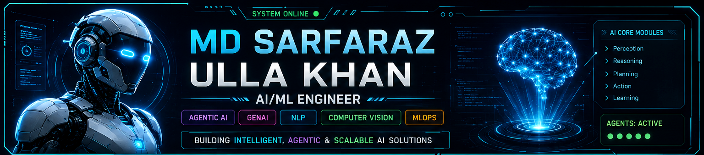
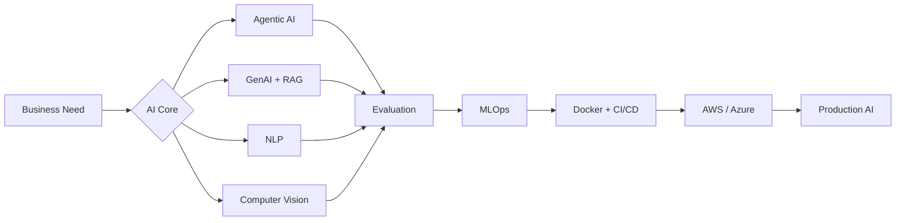

<div align="center">



<br/>

<a href="https://git.io/typing-svg">
  
</a>

<br/>


<br/><br/>

<a href="https://www.linkedin.com/in/sarfaraz-khan-ba0011269">
  
</a>
<a href="https://github.com/mohdsarfarazullakhan">
  
</a>

</div>

---

## 🤖 `AI CORE // ABOUT ME`

```python
sarfaraz = {
    "role": "AI/ML Engineer",
    "base": "United Arab Emirates 🇦🇪",
    "core": [
        "Agentic AI & Multi-Agent Systems",
        "Generative AI & RAG",
        "Natural Language Processing",
        "Computer Vision & Video Analytics",
        "MLOps & Cloud Deployment"
    ],
    "mission": "Build intelligent AI systems that are useful, measurable and deployable.",
    "mode": "BUILD → EVALUATE → DEPLOY → IMPROVE"
}
```

I build **end-to-end AI systems** that move beyond notebooks — combining models, retrieval, agents, NLP, computer vision, automation, evaluation, APIs, MLOps and cloud deployment into practical products.

- 🧠 **Agentic AI** — AI agents, multi-agent orchestration, LangChain, LangGraph and tool-driven workflows.
- ✨ **Generative AI** — RAG, LLM applications, conversational systems and grounded AI.
- 🗣️ **NLP** — embeddings, semantic search, similarity, information extraction and text intelligence.
- 👁️ **Computer Vision** — YOLO, OpenCV, object detection, tracking and automated video analytics.
- ⚙️ **MLOps** — MLflow, DVC, Docker, CI/CD, AWS and Azure deployment workflows.
- 🔗 **Automation** — APIs, webhooks, n8n and intelligent workflow integration.

---

## ⚡ `AI SYSTEM ARCHITECTURE`



---

## 🚀 `FEATURED AI SYSTEMS`

<table>
<tr>
<td width="50%" valign="top">

### 🧠 [Enterprise RAG + Agentic AI](https://github.com/mohdsarfarazullakhan/Production_Grade_Enterprise_RAG-AgenticAI-)

Production-oriented architecture combining **retrieval, LLM orchestration, RAG and agentic workflows**.

`RAG` `Agentic AI` `LangChain` `LangGraph` `LLMs`

</td>
<td width="50%" valign="top">

### 👁️ [AI Eye Proctor System](https://github.com/mohdsarfarazullakhan/eye_proctor_system)

Computer-vision system for **automated visual monitoring and intelligent proctoring workflows**.

`Python` `OpenCV` `Computer Vision` `Automation`

</td>
</tr>

<tr>
<td width="50%" valign="top">

### 📝 [AI Script Evaluation System](https://github.com/mohdsarfarazullakhan/AI_Script_Evaluation_System)

NLP-based evaluation using **TF-IDF, cosine similarity, keyword extraction and language analysis**.

`NLP` `TF-IDF` `NLTK` `Flask` `Cosine Similarity`

</td>
<td width="50%" valign="top">

### ✨ [Generative AI Projects](https://github.com/mohdsarfarazullakhan/Generative_AI_Projects)

Hands-on collection of **LLM apps, RAG systems, chatbots, agents and multi-agent workflows**.

`GenAI` `RAG` `Agents` `LangChain` `LLMs`

</td>
</tr>

<tr>
<td width="50%" valign="top">

### ⚙️ [Machine Learning Projects](https://github.com/mohdsarfarazullakhan/Machine_Learning_Projects)

Practical machine-learning projects covering **modelling, experimentation, evaluation and pipelines**.

`Python` `Scikit-learn` `Pandas` `Machine Learning`

</td>
<td width="50%" valign="top">

### 🎬 [Movie Recommendation System](https://github.com/mohdsarfarazullakhan/Movie_Recommendation_System)

Content-based recommender using **vector similarity with an interactive Streamlit application**.

`Recommendation` `Streamlit` `Python` `Cosine Similarity`

</td>
</tr>
</table>

---

## 🛠️ `TECHNOLOGY MATRIX`

<div align="center">

### `PROGRAMMING`


### `AI • ML • COMPUTER VISION`


### `BACKEND • APPLICATIONS`


### `MLOPS • CLOUD • DEVOPS`


<br/>


</div>

---

## 🧬 `CAPABILITY GRID`

| `INTELLIGENCE` | `ENGINEERING` | `DEPLOYMENT & AUTOMATION` |
|---|---|---|
| Agentic AI & Multi-Agent Systems | Python & SQL | Docker & CI/CD |
| Generative AI & LLMs | FastAPI & Flask | AWS & Azure |
| RAG & Vector Retrieval | Model Evaluation | MLflow & DVC |
| NLP & Semantic Search | REST APIs & Webhooks | n8n Automation |
| Computer Vision & YOLO | Data Processing | Monitoring & Reproducibility |

---

## ⚙️ `SYSTEM STATUS`

```text
╔══════════════════════════════════════════════════════════════════╗
║                    SARFARAZ // AI CORE                          ║
╠══════════════════════════════════════════════════════════════════╣
║  [ONLINE]  Agentic AI + Multi-Agent Orchestration              ║
║  [ONLINE]  Generative AI + Enterprise RAG                      ║
║  [ONLINE]  NLP + Semantic Search + Text Intelligence           ║
║  [ONLINE]  Computer Vision + Video Analytics                   ║
║  [ONLINE]  MLOps + Cloud Deployment                            ║
║  [ONLINE]  AI Workflow Automation                              ║
╠══════════════════════════════════════════════════════════════════╣
║  BUILD → TEST → EVALUATE → DEPLOY → MONITOR → IMPROVE         ║
╚══════════════════════════════════════════════════════════════════╝
```

---

## 📡 `CONNECT`

<div align="center">

### `Open to AI/ML • Agentic AI • GenAI • NLP • Computer Vision • MLOps opportunities`

<a href="https://www.linkedin.com/in/sarfaraz-khan-ba0011269">
  
</a>

<a href="https://github.com/mohdsarfarazullakhan">
  
</a>

<br/><br/>

```text
> INITIALIZING NEXT AI SYSTEM...
> INTELLIGENCE × ENGINEERING × DEPLOYMENT
```

</div>
