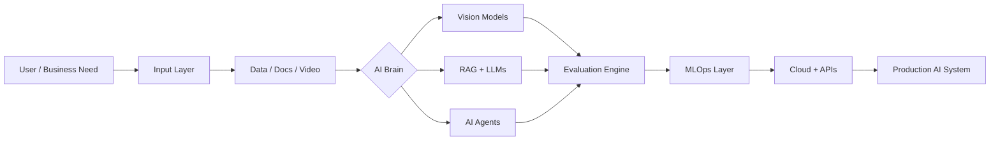

<!-- ========================================================= -->
<!--                  AI / ROBOTIC PROFILE                    -->
<!-- ========================================================= -->

<div align="center">


<a href="https://git.io/typing-svg">
  
</a>

<br/>


<br/><br/>

<a href="https://www.linkedin.com/in/sarfaraz-khan-ba0011269">
  
</a>

</div>

---

## 🤖 AI CORE // ABOUT ME

```python
AI_ENGINEER = {
    "name": "MD Sarfaraz Ulla Khan",
    "role": "AI/ML Engineer",
    "base": "United Arab Emirates",
    "modules": [
        "Generative AI + RAG",
        "Agentic AI + Multi-Agent Systems",
        "Computer Vision + Video Analytics",
        "MLOps + Cloud Deployment"
    ],
    "objective": "Transform AI prototypes into reliable real-world systems",
    "mode": "BUILD → EVALUATE → DEPLOY → IMPROVE"
}
```

I build **AI systems that move beyond notebooks** — combining models, retrieval, agents, automation, evaluation, APIs, deployment, and cloud infrastructure into usable products.

- 🧠 Designing **RAG pipelines, AI agents, and multi-agent workflows** with LangChain and LangGraph.
- 👁️ Building **computer-vision systems** with YOLO, OpenCV, tracking, and video analytics.
- ⚙️ Creating reproducible ML workflows using **Docker, MLflow, DVC, CI/CD, AWS, and Azure**.
- 🔬 Exploring **LLM evaluation, retrieval quality, guardrails, observability, and production AI architecture**.
- 🚀 Open to opportunities in **AI/ML, Generative AI, Computer Vision, Agentic AI, MLOps, and AI Automation**.

---

## 🧬 SYSTEM ARCHITECTURE



---

## 🚀 ACTIVE AI MODULES // FEATURED PROJECTS

<table>
<tr>
<td width="50%" valign="top">

### 🧠 [Enterprise RAG + Agentic AI](https://github.com/mohdsarfarazullakhan/Production_Grade_Enterprise_RAG-AgenticAI-)

Production-oriented architecture for **retrieval, orchestration, LLM workflows, and agentic AI patterns**.

`RAG` `Agentic AI` `LLMs` `LangChain` `LangGraph`

</td>
<td width="50%" valign="top">

### 👁️ [AI Eye Proctor System](https://github.com/mohdsarfarazullakhan/eye_proctor_system)

Computer-vision system for **visual monitoring and automated proctoring workflows**.

`Python` `Computer Vision` `OpenCV` `Automation`

</td>
</tr>
<tr>
<td width="50%" valign="top">

### 📝 [AI Script Evaluation System](https://github.com/mohdsarfarazullakhan/AI_Script_Evaluation_System)

Automated evaluation using **NLP, TF-IDF, cosine similarity, keyword extraction, and language analysis**.

`NLP` `Flask` `TF-IDF` `NLTK` `Cosine Similarity`

</td>
<td width="50%" valign="top">

### ✨ [Generative AI Projects](https://github.com/mohdsarfarazullakhan/Generative_AI_Projects)

Hands-on collection of **LLM apps, chatbots, memory, RAG, agents, and multi-agent workflows**.

`Generative AI` `RAG` `Agents` `LangChain` `LLMs`

</td>
</tr>
<tr>
<td width="50%" valign="top">

### ⚙️ [Machine Learning Projects](https://github.com/mohdsarfarazullakhan/Machine_Learning_Projects)

Practical **machine-learning experiments and end-to-end modeling workflows**.

`Python` `Scikit-learn` `Pandas` `Machine Learning`

</td>
<td width="50%" valign="top">

### 🎬 [Movie Recommendation System](https://github.com/mohdsarfarazullakhan/Movie_Recommendation_System)

Content-based recommendation engine using **vector similarity with an interactive application layer**.

`Recommendation System` `Streamlit` `Python` `Cosine Similarity`

</td>
</tr>
</table>

---

## 🛠️ TECHNOLOGY MATRIX

<div align="center">

### `// PROGRAMMING`


### `// AI · ML · VISION`


### `// BACKEND · APPLICATIONS`


### `// MLOps · CLOUD · DEVOPS`


<br/>


</div>

---

## 🧠 CAPABILITY GRID

| `INTELLIGENCE LAYER` | `ENGINEERING LAYER` | `AUTOMATION LAYER` |
|---|---|---|
| Generative AI & LLMs | Docker & CI/CD | Python & SQL |
| RAG & Vector Retrieval | MLflow & DVC | n8n Workflows |
| AI Agents & Multi-Agent Systems | AWS & Azure | REST APIs & Webhooks |
| Computer Vision & YOLO | Model Evaluation | Power BI & Analytics |
| NLP & Recommendation Systems | Monitoring & Reproducibility | System Integration |

---

## ⚡ CURRENT EXECUTION MODE

```text
╔══════════════════════════════════════════════════════════════════╗
║  AI SYSTEM STATUS                                               ║
╠══════════════════════════════════════════════════════════════════╣
║  [ACTIVE]  Enterprise RAG + Knowledge Systems                  ║
║  [ACTIVE]  Agentic AI + Multi-Agent Orchestration              ║
║  [ACTIVE]  Computer Vision + Video Analytics                   ║
║  [ACTIVE]  LLM Evaluation + Retrieval Quality                  ║
║  [ACTIVE]  MLOps + Cloud Deployment                            ║
║  [ACTIVE]  AI Workflow Automation                              ║
╚══════════════════════════════════════════════════════════════════╝
```

> **MISSION:** Build AI that is intelligent, measurable, reproducible, deployable, and useful.

---

## 📡 CONNECTION PORT

<div align="center">

<a href="https://www.linkedin.com/in/sarfaraz-khan-ba0011269">
  
</a>
<a href="https://github.com/mohdsarfarazullakhan">
  
</a>

<br/><br/>

```text
> INITIALIZING NEXT AI SYSTEM...
> BUILD → TEST → DEPLOY → LEARN → ITERATE
```


</div>
